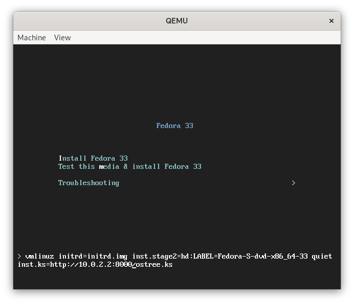

# Building OSTree image

This section contains a guide for building OSTree commits. As opposed to the "traditional" image types, these commits are not directly bootable so although they basically contain a full operating system, in order to boot them, they need to be deployed. This can, for example, be done via the  Fedora installer (Anaconda).

OSTree is a technology for creating immutable operating system images and it is a base for Fedora CoreOS, Fedora IoT, Fedora Silverblue, and RHEL for Edge. For more information on OSTree, see [their website](https://ostreedev.github.io/ostree/).

## Overview of the intended result

As mentioned above, osbuild-composer produces OSTree commits which are not directly bootable. The commits are inside a tarball to make their usage more convenient. In order to deploy them, you will need:

* Fedora installation ISO - such as netinst ([https://getfedora.org/en/server/download/](https://getfedora.org/en/server/download/))

* HTTP server to serve the content of the tarball to the Fedora virtual machine booted from the ISO

* Kickstart file that instructs Anaconda (Fedora installer) to use the OSTree commit from the HTTP server

In this guide, a container running Apache `httpd` will be used as the HTTP server.

The result will look like this:

```
 _________________          ____________________________
|                 |        |                            |
|                 |------->| Fedora VM with mounted ISO |
|                 |        |  - Anaconda                |
|  Fedora Host OS |        |____________________________|
|                 |                |
|                 |         _______|________________________
|                 |        |                                |
|                 |------->| Fedora container running httpd |
|_________________|        |  serving content of the tarball|
                           |  and the kickstart file        |
                           |________________________________|
```

*Note: If you would like to understand what is inside the tarball, read the upstream OSTree documentation.*

## Building an OSTree commit

Start by creating a blueprint for your commit. Using your favorite text editor, `vi`, create a file named `fishy.toml` with this content:

```toml
name = "fishy-commit"
description = "Fishy OSTree commit"
version = "0.0.1"

[[packages]]
name = "fish"
version = "*"
```

Now push the blueprint to osbuild-composer using `composer-cli`:

```
$ composer-cli blueprints push fishy.toml
```

And start a build:

```
$ composer-cli compose start fishy-commit fedora-iot-commit
Compose 8e8014f8-4d15-441a-a26d-9ed7fc89e23a added to the queue
```

Monitor the build status using:

```
$ composer-cli compose status
```

And finally when the compose is complete, download the result:

```
$ composer-cli compose image 8e8014f8-4d15-441a-a26d-9ed7fc89e23a
8e8014f8-4d15-441a-a26d-9ed7fc89e23a-commit.tar: 670.45 MB
```

## Writing a Kickstart file

As mentioned above, the Kickstart file is meant for the Anaconda installer. It contains instructions on how to install the system.

Create a file named `ostree.ks` with this content:

```
lang en_US.UTF-8
keyboard us
timezone UTC
zerombr
clearpart --all --initlabel
autopart
reboot
user --name=core --groups=wheel --password=foobar
ostreesetup --nogpg --url=http://10.0.2.2:8000/repo/ --osname=iot --remote=iot --ref=fedora/33/x86_64/iot
```

For those interested in all the options, you can read [Anaconda’s documentation](https://anaconda-installer.readthedocs.io/en/latest/index.html).

The crucial part is on the last line. Here, `ostreesetup` command is used to fetch the OSTree commit. Now for those wondering about the IP address, this tutorial uses `qemu` to boot the virtual machine and `10.0.2.2` is an address which you can use to reach the host system from the guest: [User Networking](https://wiki.qemu.org/Documentation/Networking#User_Networking_.28SLIRP.29).

## Setting up an HTTP server

Now that the kickstart file and OSTree commit are ready, create a container running HTTP server and serving those file. Start by creating a Dockerfile:

```dockerfile
FROM fedora:latest
RUN dnf -y install httpd && dnf clean all
ADD *.tar *.ks /var/www/html
EXPOSE 80
CMD ["/usr/sbin/httpd", "-D", "FOREGROUND"]
```

Make sure you have everything in the build directory (keep in mind that the UUID is random, so it will be different in your case):

```
$ ls
8e8014f8-4d15-441a-a26d-9ed7fc89e23a-commit.tar
Dockerfile
ostree.ks
```

Build the container image:

```
$ podman build -t ostree .
```

And run it:

```
$ podman run --rm -p 8000:80 ostree
```

*Note: You might be wondering why to bother with a container when you can just use "python -m http.server". The problem is that OSTree produces way too many requests and the Python HTTP server simply fails to keep up with OSTree.*

## Running a VM and applying the OSTree commit

Start with downloading the Netinstall image from here: [https://getfedora.org/en/server/download/](https://getfedora.org/en/server/download/)

Create an empty qcow2 image. That is an image of a hard drive for the virtual machine (VM).
```
$ qemu-img create -f qcow2 disk-image.img 5G
```
Run a VM using the hard drive and mount the installation ISO:
```
$ qemu-system-x86_64 \
          -enable-kvm \
          -m 3000 \
          -snapshot \
          -cpu host \
          -net nic,model=virtio \
          -net user,hostfwd=tcp::2223-:22 \
          -cdrom $HOME/Downloads/Fedora-Server-netinst-x86_64-33-1.2.iso \
          disk-image.img
```
*Note: To prevent any issue, use the latest stable Fedora host OS for this tutorial.*

This command instructs qemu (the hypervisor) to:

* Use KVM virtualization (makes the VM faster).
* Increase memory to 3000MB (some processes can get memory hungry, for example `dnf`).
* Snapshot the hard drive image, don't override its content.
* Use the same CPU type as the host uses.
* Connect the guest to a virtual network bridge on the host and forward TCP port 2223 from the host to the SSH port (22) on the guest (makes it easier to connect to the guest system).
* Mount the installation ISO.
* Use the hard drive image created above.

At the initial screen, use arrow keys to select the "Install Fedora 33" line and press TAB key. You’ll see a line of kernel command line options appear below. Something like:



```
vmlinuz initrd=initrd.img inst.stage2=hd:LABEL=Fedora quiet
```
Add a space and this string:
```
inst.ks=http://10.0.2.2:8000/ostree.ks
```
Resulting in this kernel command line:
```
vmlinuz initrd=initrd.img inst.stage2=hd:LABEL=Fedora quiet inst.ks=http://10.0.2.2:8000/ostree.ks
```
The IP address `10.0.2.2` is again used here, because the VM is running inside Qemu.

Press "Enter", the Anaconda GUI will show up and automatically install the OSTree commit created above.

Once the system is installed and rebooted, use username "core" and password "foobar" to login. You can change the credentials in the kickstart file.
